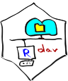

<!-- badges: start -->
[](https://cran.r-project.org/package=rdav)
[](https://gk-crop.r-universe.dev/rdav)
[](https://github.com/gk-crop/rdav/actions/workflows/r.yml)
<!-- badges: end -->

# Simple WebDAV client 

Provides some functions to 

* download a file or a folder (recursively) from a WebDAV server
* upload a file or a folder (recursively) to a WebDAV server
* copy, move, delete files or folders on a WebDAV server
* list directories on the WebDAV server

Notice: when uploading or downloading files, they are overwritten without any
warnings. 

## Installation

To install the stable version from CRAN please use
```
install.packates('rdav')
```

You can install the most recent development version from r-universe.dev

```
install.packages('rdav', 
     repos = c('https://gk-crop.r-universe.dev', 'https://cloud.r-project.org'))
```

## Usage

You have to supply the URL to the WebDAV server and your username. Once you
call wd_connect, you will be prompted for the password.

```
library(rdav)
r <- wd_connect("https://example.com/remote.php/dav/files/user", "user")

wd_dir(r) # lists the main directory
wd_dir(r, "subdir", as_df = TRUE) # lists 'subdir', returns a dataframe

```

Create folder, upload and download data

```
wd_mkdir(r,"myfolder")
wd_upload(r, "testfile.R", "myfolder/testfile.R")
wd_download(r, "myfolder", "d:/data/fromserver")
```

Share files via public link or e-mail

```
ocs_create_share_link(r, "myfolder")
ocs_create_share_mail(r, "myfolder", "mail@example.com")
```